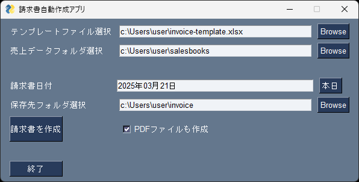

# 請求書自動作成アプリ
 
 

## スクリーンショット

## 概要
このアプリは、複数の担当者ごとに管理されている売上データを自動的に処理し、顧客ごとに請求書を作成するツールです。  
複数のExcelファイルを開いて手作業で行われていた請求書作成業務を自動化することで、作業時間を短縮し、ヒューマンエラーを防ぎます。

## 機能
1. データの読み込み
  - FreeSimpleGUIを使って請求書のテンプレートファイル, 売上データフォルダ, 請求書作成フォルダ, 請求日をGUIで指定できます。 
  - 複数ファイルの売上データなどのExcelファイルを読み込みます。データは以下の情報を扱います。
    - 日付
    - 顧客名
    - 購入品目
    - 個数
    - 単価
    - 小計

2. データの統合と仕分け
  - 複数の担当者ファイルを統合し、顧客ごとに売上データを集計します。
  - 同一顧客のデータを自動でまとめ、請求書の内容を作成します。

3. 請求書の生成
  - 各顧客ごとに請求書を作成し、予め作成しておいたテンプレートファイルでExcelを作成します。  
  使用OSがWindowsでExcelがインストールされている場合はPDF作成も選択できます。

4. GUI操作
  - FreeSimpleGUIを使用したシンプルなインターフェースを搭載。
  - ファイルの選択、生成された請求書の保存先指定などを操作可能。

## 使用言語、ライブラリ
  - Python
  - FreeSimpleGUI
    - 使いやすさを考慮し、GUIで操作できるように実装。
  - openpyxl
    - Excelファイルの読込 / 請求書の作成。
  - Pandas
    - データの集計処理を効率化。
  - pywin32
    - Win32 APIを使ってEXcelを操作しPDFを作成する機能を実装。

## 動作環境
- Python 3.12系以降（3.12.6以降, 3.13.1で動作確認済み）
- 必要なライブラリ: openpyxl, pandas, FreeSimpleGUI, pywin32(Windowsのみ)
- 対応OS: Windows, macOS(機種を取得して動作を分けている。macOSで実行する際はPDF作成機能は使えない)

## 使い方
- 前準備:  
担当者ごとの売上データファイルを同じフォルダ内にコピーしておく。  
デフォルトではBrowseボタンを押した際, スクリプトのフォルダ内,[salesbooks]フォルダが選ばれている。
1. [テンプレートファイル選択] のBrowseボタンを押して請求書テンプレートファイルを指定。
2. [売上データフォルダ選択] のBrowseボタンを押して前準備で用意しておいた売上データファイルが入っているフォルダを指定。
3. [請求書日付] に、請求書に記載する請求日を記載。本日ボタンを押すと日時が本日にリセットされる。
4. [PDFファイルも作成] にチェックを入れるとPDFファイルも作成することが出来る(Windowsのみ)。
5. [請求書を作成] ボタンを押すとポップアップが表示されるので、Yesボタンを押すと処理が開始される。
6. 完了すると、ポップアップが表示されるのでOKボタンを押して閉じる。
7. [終了]ボタンを押すか、Windowsではアプリ右上の[x]ボタン、macOSではアプリ左上の赤い[x]ボタンを押して終了。

### **スクリーンショットを用いた使い方は現在準備中です。**

## 工夫した点
- シンプルなUI: FreeSimpleGUIを使用してGUIで操作できるようにした。
- データの集計処理: openpyxlだけではなく, pandasも使用してデータ処理を行うようにした。
- OSを判定し、Windows, macOSで一部の処理を分岐させるようにした。
- openpyxlで保存する際のエラーハンドリング(try - except)を行うようにした。
- WindowsではPDF作成機能の使用/不使用を選択できるようにした。

## ライセンス
このアプリはMITライセンスのもとで公開されています。

### 注意
このプロジェクトでは、GUI部分に [FreeSimpleGUI](https://github.com/spyoungtech/FreeSimpleGui) を使用しています。  
FreeSimpleGUIのライセンスに関する情報は [FreeSimpleGUI公式ページ](https://github.com/spyoungtech/FreeSimpleGui) で確認して下さい。

## 今後の予定
以下のように計画していますが、進行具合や状況により変更される可能性があります。

- ドキュメントの充実
- リファクタリング
- 顧客への自動メール送信
- ハードコーディングの排除

※これらは計画段階のものであり、進行状況により変更される場合があります。
